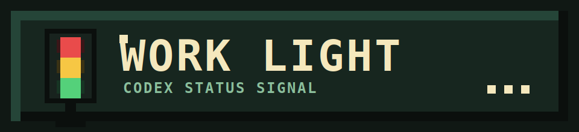
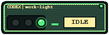
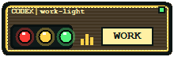
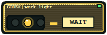
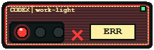
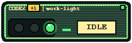

<p align="center">
  
</p>

# Work Light

A small Windows floating status window for Codex command hooks.

[中文说明](README_zh.md)

## What It Does

Work Light listens for local Codex hook events and turns them into a compact desktop signal. It is meant to sit on top of your Windows desktop while Codex is working, waiting for permission, idle, or reporting an error.

The local hook endpoint is:

```text
POST http://127.0.0.1:17373/codex/hook
```

## Features

- Windows floating desktop window with a pixel-style signal light.
- Wails 3 + Go backend with a React + TypeScript frontend.
- Local-only hook receiver on `127.0.0.1:17373`.
- Status mapping for Codex activity, permission requests, stop events, and error-like payloads.
- Multi-session badge when other active Codex sessions are visible.
- Frontend assets embedded into the executable with `go:embed`.

## Screenshots

| Idle | Working | Waiting |
| --- | --- | --- |
|  |  |  |

| Error | Multi-session |
| --- | --- |
|  |  |

## How It Works

Codex command hooks receive JSON on stdin. The payload can include fields such as `session_id`, `cwd`, `hook_event_name`, and `permission_mode`.

The forwarding script reads that JSON from stdin and posts it to Work Light:

```text
Codex hook -> scripts/codex-hook-forward.* -> 127.0.0.1:17373/codex/hook -> Work Light window
```

The Go backend stores recent sessions, derives a status, and emits updates to the Wails window. The frontend renders the primary workspace plus a badge for other active sessions.

Status priority is:

```text
error > waiting_confirmation > working > idle > offline
```

## Requirements

- Windows for running the desktop window.
- Go with Wails v3 alpha dependencies. This project currently uses `github.com/wailsapp/wails/v3 v3.0.0-alpha.96`; Wails v3 APIs may change.
- Node.js and npm for the React frontend build.
- Bash for `scripts/build-windows.sh`.
- `curl` for the shell hook forwarder, or PowerShell for the Windows forwarder.

## Build

From the repository root:

```sh
bash scripts/build-windows.sh
```

The script installs frontend dependencies, builds the frontend, and then cross-compiles the Windows executable:

```sh
GOOS=windows GOARCH=amd64 CGO_ENABLED=0 go build -buildvcs=false -ldflags "-H=windowsgui" -o dist/work-light.exe .
```

Output:

```text
dist/work-light.exe
```

The frontend is embedded with `go:embed`, so the executable does not need a neighboring `frontend/dist` directory at runtime.

## Run

On Windows:

```powershell
.\dist\work-light.exe
```

When running, Work Light listens locally at:

```text
http://127.0.0.1:17373/codex/hook
```

## Configure Codex Hooks

Set `WORK_LIGHT_DIR` to your checkout path, or replace it with an absolute path such as `/path/to/work-light`.

```sh
export WORK_LIGHT_DIR=/path/to/work-light
```

Codex hooks use nested array-of-table TOML entries. The following examples send common Codex hook events to Work Light:

```toml
[[hooks.SessionStart]]
[[hooks.SessionStart.hooks]]
type = "command"
command = "${WORK_LIGHT_DIR}/scripts/codex-hook-forward.sh"
timeout = 2

[[hooks.UserPromptSubmit]]
[[hooks.UserPromptSubmit.hooks]]
type = "command"
command = "${WORK_LIGHT_DIR}/scripts/codex-hook-forward.sh"
timeout = 2

[[hooks.PreToolUse]]
[[hooks.PreToolUse.hooks]]
type = "command"
command = "${WORK_LIGHT_DIR}/scripts/codex-hook-forward.sh"
timeout = 2

[[hooks.PostToolUse]]
[[hooks.PostToolUse.hooks]]
type = "command"
command = "${WORK_LIGHT_DIR}/scripts/codex-hook-forward.sh"
timeout = 2

[[hooks.PermissionRequest]]
[[hooks.PermissionRequest.hooks]]
type = "command"
command = "${WORK_LIGHT_DIR}/scripts/codex-hook-forward.sh"
timeout = 2

[[hooks.SubagentStart]]
[[hooks.SubagentStart.hooks]]
type = "command"
command = "${WORK_LIGHT_DIR}/scripts/codex-hook-forward.sh"
timeout = 2

[[hooks.SubagentStop]]
[[hooks.SubagentStop.hooks]]
type = "command"
command = "${WORK_LIGHT_DIR}/scripts/codex-hook-forward.sh"
timeout = 2

[[hooks.Stop]]
[[hooks.Stop.hooks]]
type = "command"
command = "${WORK_LIGHT_DIR}/scripts/codex-hook-forward.sh"
timeout = 2
```

For native Windows Codex runs, use the PowerShell forwarder. If you keep one
shared configuration for multiple platforms, `command_windows` can override the
Unix command on Windows:

```toml
[[hooks.SessionStart]]
[[hooks.SessionStart.hooks]]
type = "command"
command = "${WORK_LIGHT_DIR}/scripts/codex-hook-forward.sh"
command_windows = 'powershell -NoProfile -ExecutionPolicy Bypass -File "C:\path\to\work-light\scripts\codex-hook-forward.ps1"'
timeout = 2
```

Repeat the same entry shape for the events you want to forward.

If you only run Codex on Windows, you can omit `command` and keep only the
PowerShell command in each hook entry.

## Hook Endpoint

Work Light accepts:

```http
POST /codex/hook
Content-Type: application/json
```

Example payload:

```json
{
  "hook_event_name": "PermissionRequest",
  "session_id": "example-session",
  "cwd": "/path/to/work-light",
  "permission_mode": "on-request"
}
```

The handler returns `202 Accepted` with the derived status event. Invalid JSON returns `400`, and methods other than `POST` return `405`.

The forwarding scripts intentionally exit successfully if Work Light is not running, so Codex is not blocked by a missing status window.

## Development

Build or test the frontend directly:

```sh
npm --prefix frontend test
npm --prefix frontend run build
```

Run Go tests:

```sh
GOCACHE=/tmp/work-light-go-build go test -buildvcs=false ./frontend ./internal/...
GOOS=windows GOARCH=amd64 CGO_ENABLED=0 go test -buildvcs=false .
```

The Wails app embeds frontend output through `frontend/assets.go`, so rebuild the frontend before building the Windows executable.

## Troubleshooting

- No window updates: make sure `dist/work-light.exe` is running and listening on `127.0.0.1:17373`.
- Hook command not found: replace `${WORK_LIGHT_DIR}` with an absolute path such as `/path/to/work-light`.
- Windows native hooks do nothing: check that the PowerShell path points to `scripts\codex-hook-forward.ps1`.
- Build fails after changing Wails dependencies: this project uses Wails v3 alpha, so API changes may require code updates.
- Codex feels delayed: keep hook `timeout` low, for example `timeout = 2`.

## License Note

Work Light is released under the [MIT License](LICENSE).
