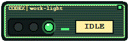

<p align="center">
  
</p>

# Work Light

Work Light 是一个用于 Codex command hooks 的 Windows 桌面悬浮状态灯。

[English README](README.md)

## 它能做什么

Work Light 在本机接收 Codex hook 事件，并把 Codex 当前状态显示成一个紧凑的桌面信号灯。它适合放在 Windows 桌面顶部，用来观察 Codex 是否正在工作、等待授权、空闲或进入错误状态。

本地 hook 接收端点为：

```text
POST http://127.0.0.1:17373/codex/hook
```

## 功能

- Windows 桌面悬浮窗，像素风状态灯界面。
- Wails 3 + Go 后端，React + TypeScript 前端。
- 只监听本机 `127.0.0.1:17373`。
- 支持 Codex 活动、权限请求、停止事件和错误类 payload 的状态映射。
- 多个 Codex 会话同时活跃时显示多会话角标。
- 前端资源通过 `go:embed` 打包进可执行文件。

## 界面截图



## 工作原理

Codex command hooks 会从 stdin 接收 JSON。这个 JSON 可以包含 `session_id`、`cwd`、`hook_event_name`、`permission_mode` 等字段。

转发脚本读取 stdin 中的 JSON，然后发送给 Work Light：

```text
Codex hook -> scripts/codex-hook-forward.* -> 127.0.0.1:17373/codex/hook -> Work Light window
```

Go 后端会保存最近的会话，计算当前状态，并把更新事件发送给 Wails 窗口。前端显示主工作区状态，并在存在其他活跃会话时显示角标。

状态优先级为：

```text
error > waiting_confirmation > working > idle > offline
```

## 环境要求

- Windows，用于运行桌面悬浮窗。
- Go 和 Wails v3 alpha 依赖。本项目当前使用 `github.com/wailsapp/wails/v3 v3.0.0-alpha.96`；Wails v3 仍处于 alpha 阶段，API 可能变化。
- Node.js 和 npm，用于构建 React 前端。
- Bash，用于运行 `scripts/build-windows.sh`。
- shell 转发脚本需要 `curl`；Windows 转发脚本需要 PowerShell。

## 构建

在仓库根目录运行：

```sh
bash scripts/build-windows.sh
```

脚本会安装前端依赖、构建前端，然后交叉编译 Windows 可执行文件：

```sh
GOOS=windows GOARCH=amd64 CGO_ENABLED=0 go build -buildvcs=false -ldflags "-H=windowsgui" -o dist/work-light.exe .
```

输出路径：

```text
dist/work-light.exe
```

前端会通过 `go:embed` 嵌入可执行文件，运行时不需要在同目录携带 `frontend/dist`。

## 运行

在 Windows 上运行：

```powershell
.\dist\work-light.exe
```

启动后，Work Light 会在本机监听：

```text
http://127.0.0.1:17373/codex/hook
```

## 配置 Codex Hooks

先把 `WORK_LIGHT_DIR` 设置为你的仓库路径，或者在配置里直接替换成 `/path/to/work-light` 这样的绝对路径。

```sh
export WORK_LIGHT_DIR=/path/to/work-light
```

Codex hooks 使用嵌套的 TOML array-of-table 形式。下面的示例会把常见 Codex hook 事件转发给 Work Light：

```toml
[[hooks.SessionStart]]
[[hooks.SessionStart.hooks]]
type = "command"
command = "${WORK_LIGHT_DIR}/scripts/codex-hook-forward.sh"
timeout = 2

[[hooks.UserPromptSubmit]]
[[hooks.UserPromptSubmit.hooks]]
type = "command"
command = "${WORK_LIGHT_DIR}/scripts/codex-hook-forward.sh"
timeout = 2

[[hooks.PreToolUse]]
[[hooks.PreToolUse.hooks]]
type = "command"
command = "${WORK_LIGHT_DIR}/scripts/codex-hook-forward.sh"
timeout = 2

[[hooks.PostToolUse]]
[[hooks.PostToolUse.hooks]]
type = "command"
command = "${WORK_LIGHT_DIR}/scripts/codex-hook-forward.sh"
timeout = 2

[[hooks.PermissionRequest]]
[[hooks.PermissionRequest.hooks]]
type = "command"
command = "${WORK_LIGHT_DIR}/scripts/codex-hook-forward.sh"
timeout = 2

[[hooks.SubagentStart]]
[[hooks.SubagentStart.hooks]]
type = "command"
command = "${WORK_LIGHT_DIR}/scripts/codex-hook-forward.sh"
timeout = 2

[[hooks.SubagentStop]]
[[hooks.SubagentStop.hooks]]
type = "command"
command = "${WORK_LIGHT_DIR}/scripts/codex-hook-forward.sh"
timeout = 2

[[hooks.Stop]]
[[hooks.Stop.hooks]]
type = "command"
command = "${WORK_LIGHT_DIR}/scripts/codex-hook-forward.sh"
timeout = 2
```

如果在 Windows 原生命令环境运行 Codex，可以使用 PowerShell 转发脚本。如果你维护一份跨平台配置，`command_windows` 可以在 Windows 上覆盖 Unix 命令：

```toml
[[hooks.SessionStart]]
[[hooks.SessionStart.hooks]]
type = "command"
command = "${WORK_LIGHT_DIR}/scripts/codex-hook-forward.sh"
command_windows = 'powershell -NoProfile -ExecutionPolicy Bypass -File "C:\path\to\work-light\scripts\codex-hook-forward.ps1"'
timeout = 2
```

需要转发其他事件时，按同样的结构重复配置即可。

如果你只在 Windows 上运行 Codex，也可以省略 `command`，每个 hook 只保留 PowerShell 命令。

## Hook Endpoint

Work Light 接收：

```http
POST /codex/hook
Content-Type: application/json
```

示例 payload：

```json
{
  "hook_event_name": "PermissionRequest",
  "session_id": "example-session",
  "cwd": "/path/to/work-light",
  "permission_mode": "on-request"
}
```

处理成功时返回 `202 Accepted` 和计算后的状态事件。JSON 无效时返回 `400`，非 `POST` 请求返回 `405`。

转发脚本会在 Work Light 未运行时保持成功退出，避免因为状态窗口未启动而阻塞 Codex。

## 开发

单独构建或测试前端：

```sh
npm --prefix frontend test
npm --prefix frontend run build
```

运行 Go 测试：

```sh
GOCACHE=/tmp/work-light-go-build go test -buildvcs=false ./frontend ./internal/...
GOOS=windows GOARCH=amd64 CGO_ENABLED=0 go test -buildvcs=false .
```

Wails 应用通过 `frontend/assets.go` 嵌入前端产物，因此构建 Windows 可执行文件前需要先构建前端。

## 故障排查

- 窗口没有更新：确认 `dist/work-light.exe` 正在运行，并监听 `127.0.0.1:17373`。
- hook 命令找不到：把 `${WORK_LIGHT_DIR}` 替换成 `/path/to/work-light` 这样的绝对路径。
- Windows 原生 hook 没有效果：检查 PowerShell 命令是否指向 `scripts\codex-hook-forward.ps1`。
- 修改 Wails 依赖后构建失败：本项目使用 Wails v3 alpha，API 变化可能需要同步调整代码。
- Codex 被 hook 拖慢：保持较短的 hook 超时时间，例如 `timeout = 2`。

## 许可证说明

Work Light 使用 [MIT License](LICENSE) 发布。
